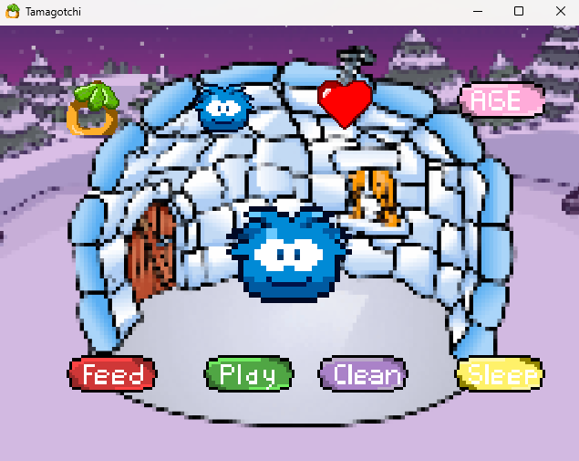

# Tamagotchi
<h1>Java Tamagotchi</h1>

<h2>Description</h2>
The start of a Tamagotchi game that I can run in the background on my computer. I took inspiration from this game, similar to Tamagotchi and the Apple game "Pou".
 

<h2>Languages and Utilities Used</h2>

- <b>Java</b> 
- <b>Intellij</b>
- <b>LibGDX</b>
- <b>piskel</b>

<h2>Environments Used </h2>

- <b>Windows 11</b> 
